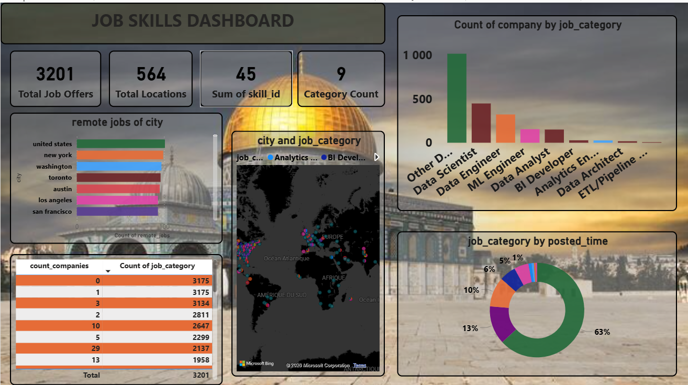

# Dashboard Power BI - Analyse des Offres d'Emploi

Ce dossier contient le dashboard Power BI pour l'analyse et la visualisation des offres d'emploi dans le secteur Data.

## Aperçu du Dashboard

## Fichiers

### `jobs-power-bi.pbix`
Le fichier Power BI contenant tous les dashboards, rapports et visualisations.

### `image.png`
Capture d'écran ou image d'exemple du dashboard.

## Fonctionnalités du Dashboard

Le dashboard fournit une analyse complète des données d'emploi :

- **Vue d'ensemble** : Métriques clés et KPIs sur les offres d'emploi
- **Analyse par Localisation** : Distribution géographique des offres
- **Analyse par Compétences** : Demande de compétences et tendances
- **Analyse Temporelle** : Évolution des offres au fil du temps
- **Filtrage Multi-Critères** : Filtrage par catégorie, localisation, compétences

## Utilisation

1. **Installer Power BI Desktop** (gratuit) : https://powerbi.microsoft.com/fr-fr/desktop/
2. **Ouvrir le fichier** : `jobs-power-bi.pbix`
3. **Explorer les visualisations** : Cliquez sur les différents onglets pour explorer
4. **Filtrer les données** : Utilisez les filtres en haut à droite

## Sources de Données

Le dashboard utilise les données du pipeline dbt suivant :

- **Bronze Layer** : Données brutes des offres d'emploi
- **Silver Layer** : Données nettoyées et transformées
- **Gold Layer** : Agrégations et dimensions finales pour les rapports

## Architecture

### Tables Gold utilisées
- `dim_company.csv` : Dimensions des entreprises
- `dim_location.csv` : Dimensions des localisations
- `dim_skills.csv` : Dimensions des compétences
- `dim_time.csv` : Dimensions temporelles
- `fact_job_offers.csv` : Faits des offres d'emploi
- `fact_job_skills.csv` : Lien entre offres et compétences

### Agrégations disponibles
- `agg_job_offers_by_category_time.csv` : Offres par catégorie et période
- `agg_location_analysis.csv` : Analyse par localisation
- `agg_skills_demand.csv` : Demande de compétences

## Maintenance

Pour mettre à jour les données :

1. Exécutez le pipeline dbt pour générer les tables Gold
2. Actualisez la connexion dans Power BI Desktop
3. Publiez sur Power BI Service (si utilisé en environnement partagé)

## Support

Pour plus d'informations sur le pipeline de données, consultez la documentation dbt dans le dossier `dbt_project/`.
