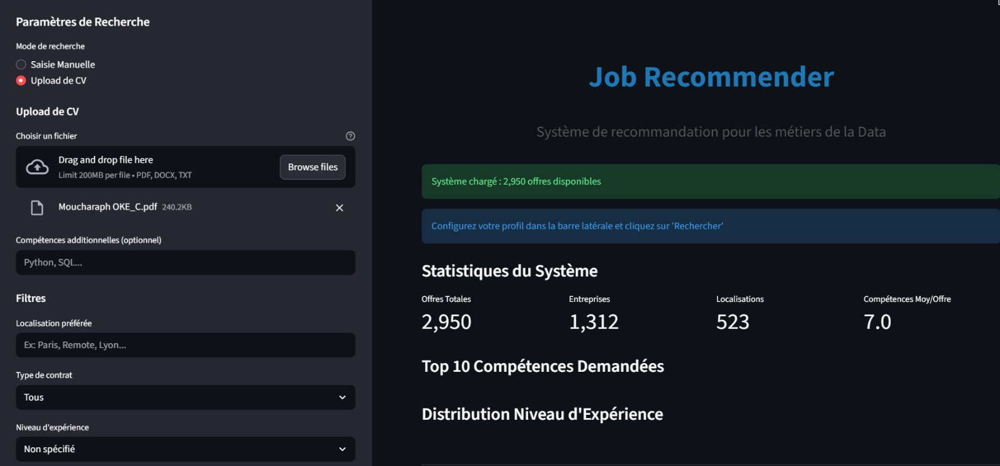
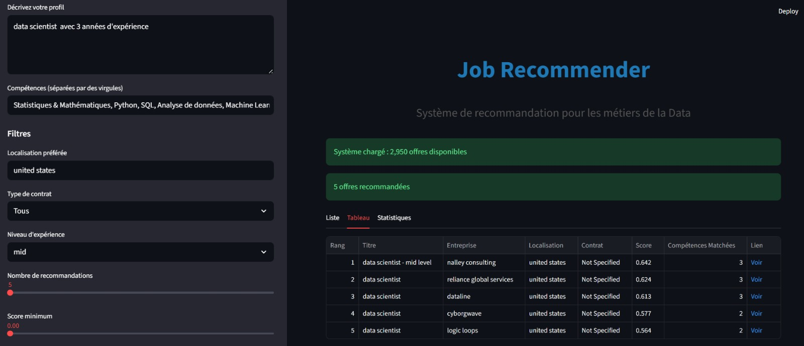
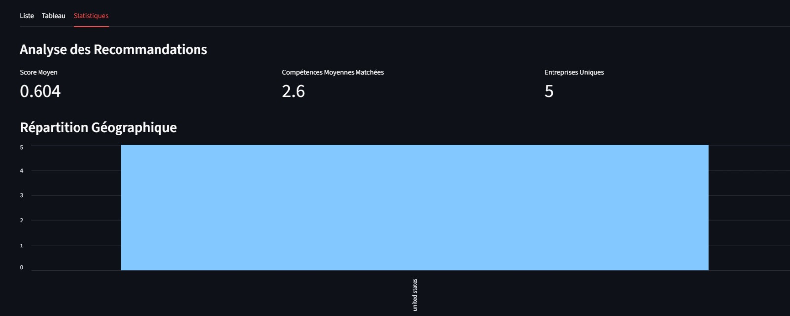
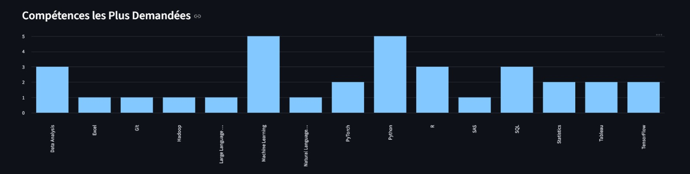

# Système de Recommandation d'Offres d'Emploi

Ce système de recommandation utilise des techniques de NLP (Sentence-BERT) pour matcher les profils candidats avec les offres d'emploi dans le domaine de la Data.

## Vue d'ensemble

### Architecture du Système


### Pipeline de Traitement


### Interface API


### Résultats et Recommandations


## Fonctionnalités

- **Analyse Sémantique Avancée** : Utilise Sentence-BERT pour comprendre le sens des descriptions
- **Parsing de CV** : Extraction automatique du texte depuis PDF, DOCX, TXT
- **Recherche Vectorielle Rapide** : FAISS pour chercher parmi 200K+ offres en <100ms
- **Scoring Multi-Critères** : Combine similarité sémantique, compétences, localisation, etc.
- **API REST** : Interface FastAPI avec documentation automatique
- **Interface Web** : Application Streamlit (en développement)

## Prérequis

- Python 3.8 ou supérieur
- 4GB RAM minimum (pour charger les embeddings)
- Windows, macOS, ou Linux

## Installation

### 1. Créer un environnement virtuel (recommandé)

```bash
# Naviguer vers le dossier du projet
cd c:\Users\em\Desktop\projet-jobs\recommendation_system

# Créer l'environnement virtuel
python -m venv venv

# Activer l'environnement (Windows)
.\venv\Scripts\activate

# Activer l'environnement (macOS/Linux)
source venv/bin/activate
```

### 2. Installer les dépendances

```bash
pip install -r requirements.txt
```

### 3. Télécharger le modèle spaCy (optionnel, pour extraction compétences avancée)

```bash
python -m spacy download fr_core_news_lg
```

## Utilisation

### Option 1 : Test Direct du Recommender

```bash
python job_recommender.py
```

Cette commande va :
1. Charger les 200K+ offres depuis `final_data.csv`
2. Créer les embeddings (peut prendre 5-10 minutes la première fois)
3. Sauvegarder les embeddings pour utilisation future
4. Tester avec un profil candidat exemple

### Option 2 : Lancer l'API FastAPI

```bash
python api.py
```

Puis ouvrir dans votre navigateur :
- **Documentation interactive** : http://localhost:8000/docs
- **Alternative ReDoc** : http://localhost:8000/redoc

#### Endpoints Disponibles

| Endpoint | Méthode | Description |
|----------|---------|-------------|
| `/api/v1/recommend` | POST | Recommandations depuis profil texte + keywords |
| `/api/v1/recommend/cv` | POST | Recommandations depuis upload CV |
| `/api/v1/jobs/{job_id}` | GET | Détails d'une offre |
| `/api/v1/jobs/{job_id}/similar` | GET | Offres similaires |
| `/api/v1/stats` | GET | Statistiques système |

#### Exemple d'utilisation de l'API (avec curl)

```bash
# Recommandations depuis un profil
curl -X POST "http://localhost:8000/api/v1/recommend" \
  -H "Content-Type: application/json" \
  -d '{
    "profile_text": "Data Scientist avec 3 ans expérience en Machine Learning",
    "keywords": ["Python", "TensorFlow", "SQL"],
    "location_preference": "Paris",
    "contract_type_preference": "Full-time",
    "top_k": 10
  }'

# Upload d'un CV
curl -X POST "http://localhost:8000/api/v1/recommend/cv" \
  -F "cv_file=@/path/to/cv.pdf" \
  -F "keywords=Python,Machine Learning" \
  -F "top_k=10"
```

#### Exemple avec Python `requests`

```python
import requests

# Recommandations depuis profil
url = "http://localhost:8000/api/v1/recommend"
payload = {
    "profile_text": "Data Analyst avec SQL, Python, et Power BI",
    "keywords": ["SQL", "Python", "Power BI", "Tableau"],
    "location_preference": "Paris",
    "top_k": 10
}

response = requests.post(url, json=payload)
recommendations = response.json()

# Afficher les résultats
for rec in recommendations['recommendations']:
    print(f"{rec['title']} - {rec['company']} (Score: {rec['score']})")
```

### Option 3 : Interface Streamlit (À venir)

```bash
streamlit run app.py
```

## Structure du Projet

```
recommendation_system/
├── config.py                    # Configuration centrale
├── cv_parser.py                 # Parser de CV (PDF, DOCX, TXT)
├── data_preprocessing.py        # Préprocessing des données
├── job_recommender.py          # Moteur de recommandation
├── api.py                       # API FastAPI
├── app.py                       # Interface Streamlit (à venir)
├── requirements.txt             # Dépendances Python
├── data/
│   ├── embeddings/              # Embeddings sauvegardés
│   │   ├── job_embeddings.npy
│   │   ├── jobs_processed.pkl
│   │   └── faiss_index.bin
│   └── models/                  # Modèles sauvegardés
└── tests/
    └── test_recommender.py      # Tests unitaires
```

## Configuration

Vous pouvez modifier les paramètres dans `config.py` :

### Modèle d'Embeddings

```python
EMBEDDING_MODEL_NAME = "sentence-transformers/distiluse-base-multilingual-cased-v2"
```

Autres modèles possibles :
- `paraphrase-multilingual-MiniLM-L12-v2` (plus rapide)
- `all-mpnet-base-v2` (meilleur pour anglais)
- `camembert-base` (optimisé français)

### Poids du Scoring

```python
SCORING_WEIGHTS = {
    'semantic_similarity': 0.50,   # Similarité sémantique
    'skills_match': 0.25,          # Correspondance compétences
    'location_match': 0.10,        # Localisation
    'contract_type_match': 0.10,   # Type de contrat
    'experience_match': 0.05       # Niveau expérience
}
```

### Compétences Techniques

Ajouter/modifier les compétences recherchées dans `DATA_SKILLS` :

```python
DATA_SKILLS = [
    'Python', 'R', 'SQL', 'Spark', 'Tableau', 'Power BI',
    'Machine Learning', 'Deep Learning', ...
]
```

## Tests

```bash
# Tester le parser de CV
python cv_parser.py /chemin/vers/cv.pdf

# Tester le preprocessor
python data_preprocessing.py

# Tester le recommender
python job_recommender.py
```

## Performance

### Première Exécution
- **Chargement données** : ~5 secondes
- **Préprocessing** : ~30 secondes
- **Génération embeddings** : ~5-10 minutes (200K offres)
- **Construction index FAISS** : ~5 secondes
- **Total** : ~10-15 minutes

### Exécutions Suivantes (embeddings sauvegardés)
- **Chargement tout** : ~10 secondes
- **Recherche/Recommandation** : <100ms par requête

### Mémoire
- **Embeddings** : ~400MB
- **Index FAISS** : ~400MB
- **DataFrame** : ~200MB
- **Total** : ~1GB RAM

## Dépannage

### Erreur: "Module not found"
```bash
pip install -r requirements.txt
```

### Erreur: "Out of memory"
Réduire le nombre d'offres en modifiant `job_recommender.py` :
```python
# Dans _create_embeddings()
self.jobs_df = self.preprocessor.preprocess_jobs_df(df_raw, sample_size=10000)
```

### Erreur: "Failed to load model"
Vérifier la connexion internet (téléchargement automatique des modèles HuggingFace)

### CV non parsé correctement
- Vérifier que le format est supporté (PDF, DOCX, TXT)
- Certains PDFs complexes peuvent avoir des problèmes d'extraction
- Essayer de sauvegarder le CV en format texte

## Prochaines Étapes

- [ ] Interface Streamlit complète
- [ ] Système de feedback utilisateur
- [ ] Clustering d'offres
- [ ] Analyse de tendances marché
- [ ] Export vers Power BI
- [ ] Déploiement cloud (Azure/AWS)

## License

Projet académique - Tous droits réservés

## Auteur

Développé dans le cadre du projet "Job Intelligent Dashboard" pour l'analyse du marché de l'emploi Data.

## Remerciements

Technologies utilisées :
- [Sentence-Transformers](https://www.sbert.net/)
- [FAISS](https://github.com/facebookresearch/faiss)
- [FastAPI](https://fastapi.tiangolo.com/)
- [Streamlit](https://streamlit.io/)
